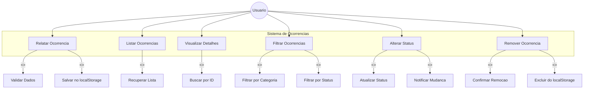

# Diagrama de Caso de Uso - Sistema de Ocorrencias

## Descricao dos Casos de Uso

### UC01 - Relatar Ocorrencia
| Campo | Descricao |
|---|---|
| **Ator principal** | Usuario |
| **Pre-condicao** | Usuario acessa a pagina de relato |
| **Pos-condicao** | Ocorrencia salva com status "Aberta" |
| **Fluxo principal** | 1. Usuario preenche formulario (titulo, descricao, categoria, local) 2. Sistema valida dados 3. Sistema gera ID unico 4. Sistema salva no localStorage 5. Sistema redireciona para listagem |
| **Excecoes** | - Campos obrigatorios nao preenchidos: exibe erros de validacao - Titulo menor que 3 caracteres: rejeita - Descricao menor que 10 caracteres: rejeita |

### UC02 - Listar Ocorrencias
| Campo | Descricao |
|---|---|
| **Ator principal** | Usuario |
| **Pre-condicao** | Existem ocorrencias registradas |
| **Pos-condicao** | Lista exibida ao usuario |
| **Fluxo principal** | 1. Sistema recupera todas as ocorrencias do localStorage 2. Sistema ordena por data (mais recente primeiro) 3. Sistema exibe lista com cards |
| **Excecoes** | - Nenhuma ocorrencia registrada: exibe mensagem "Nenhuma ocorrencia encontrada" |

### UC03 - Visualizar Detalhes
| Campo | Descricao |
|---|---|
| **Ator principal** | Usuario |
| **Pre-condicao** | Usuario seleciona uma ocorrencia |
| **Pos-condicao** | Detalhes exibidos |
| **Fluxo principal** | 1. Usuario clica em um card 2. Sistema busca ocorrencia por ID 3. Sistema exibe titulo, descricao, categoria, local, status e data |
| **Excecoes** | - Ocorrencia nao encontrada: redireciona para listagem |

### UC04 - Filtrar Ocorrencias
| Campo | Descricao |
|---|---|
| **Ator principal** | Usuario |
| **Pre-condicao** | Usuario esta na pagina de listagem |
| **Pos-condicao** | Lista filtrada exibida |
| **Fluxo principal** | 1. Usuario seleciona filtro de categoria e/ou status 2. Sistema aplica filtros na lista 3. Sistema exibe resultados filtrados com contagem |
| **Excecoes** | - Nenhum resultado para filtros: exibe mensagem "Nenhuma ocorrencia encontrada" |

### UC05 - Alterar Status
| Campo | Descricao |
|---|---|
| **Ator principal** | Usuario |
| **Pre-condicao** | Usuario esta na pagina de detalhe |
| **Pos-condicao** | Status da ocorrencia atualizado |
| **Fluxo principal** | 1. Usuario clica no botao de status desejado 2. Sistema atualiza status no localStorage 3. Sistema atualiza badge na tela |
| **Excecoes** | - Clique no status atual: botao desabilitado |

### UC06 - Remover Ocorrencia
| Campo | Descricao |
|---|---|
| **Ator principal** | Usuario |
| **Pre-condicao** | Usuario esta na pagina de detalhe |
| **Pos-condicao** | Ocorrencia removida permanentemente |
| **Fluxo principal** | 1. Usuario clica em "Remover Ocorrencia" 2. Sistema solicita confirmacao 3. Usuario confirma 4. Sistema remove do localStorage 5. Sistema redireciona para listagem |
| **Excecoes** | - Usuario cancela confirmacao: nenhuma acao |
